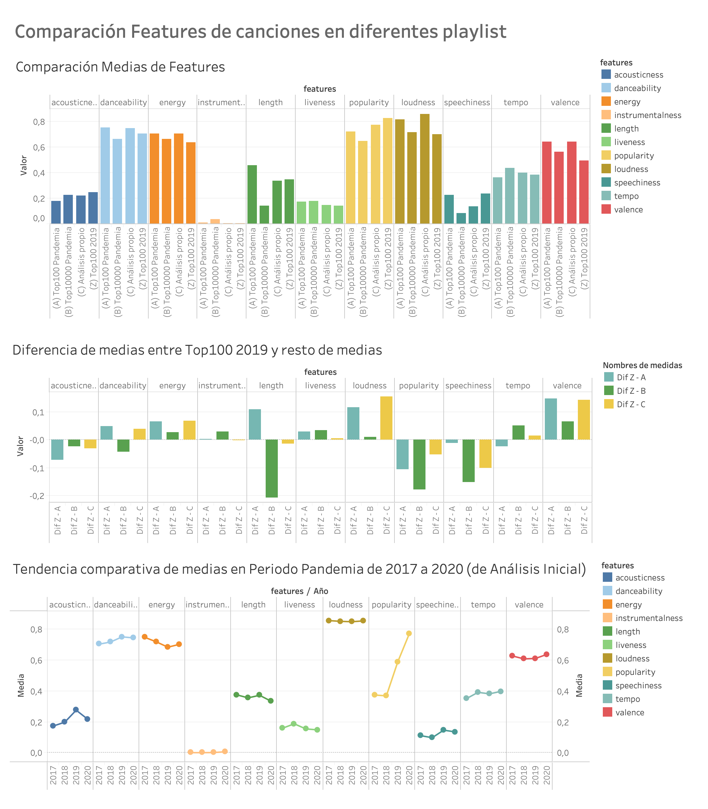
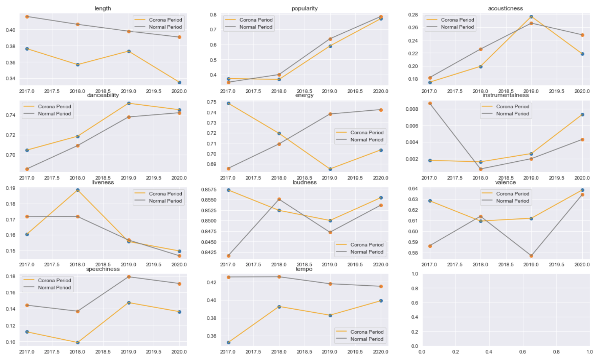
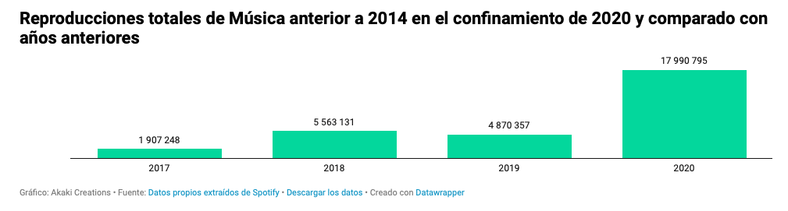

# Spotify Music Analysis before and after coronavirus pandemic

Tras escribir el artículo [¿Es Resistiré una de las canciones más escuchadas en España durante la cuarentena?](https://www.akakicreations.com/es-resistire-una-de-las-canciones-mas-escuchadas-en-espana-durante-la-cuarentena/) y encontrar datos interesantes y sobre todo curiosos, quise indagar en nuestro consumo de música en la pandemia del coronavirus en España. Este proyecto nace de una pregunta sencilla: **¿ha provocado la aparición del coronavirus un cambio en el tipo de música y estilo que se escucha en España?, ¿ha cambiado la música escuchada durante el confinamiento?** Y concretamente me hago cuatro preguntas:
1. ¿Ha provocado un cambio en el tipo de música que se escucha (más bailable, más instrumental, más enérgica...)
2. ¿Ha provocado un cambio en el género de música que se escucha (pop, reggaeton...)?
3. ¿Ha provocado un cambio en si se escuchan más éxitos antiguos?
4.  ¿Qué tipo de música contienen las playlists que se han creado para el tiempo de pandemia?, ¿hay un cambio?

Para esto, nos vamos a basar en datos que nos ofrece Spotify que es la plataforma con [mayor número de usuarios](https://es.statista.com/grafico/19793/usuarios-activos-y-de-pago-de-spotify/) de música en streaming. No es una muestra que pueda ser generalizable, pero si nos puede dar una idea de tendencias y posibles cambios de las mismas.

Este proyecto también es el trabajo de fin de master de Data Science en KSchool

# Fuentes de datos

 - Fuente de datos que ofrece la [API de Spotify](https://developer.spotify.com/documentation/web-api/) de la que se pueden sacar las características y features de todas las canciones disponibles en Spotify.
   
 - La base de datos de [Spotify Chart](https://spotifycharts.com/regional) donde se pueden extraer las 200 canciones más escuchadas (top200) por día y los respectivos streams (reproducciones) de cada una, ya que este ranking se calcula por el número de veces que se escucha una canción.

# Recomendaciones previas

Este proyecto no requiere instalaciones y entornos concretos aunque se recomienda hacer un git clone y ejecutar en Linux.

Los paquetes que se necesitan para ejecutar correctamente los notebooks son los siguientes:

 - **Fycharts:** Para descargar datos del SpotifyChart. [Documentación.](https://pypi.org/project/fycharts/) Instalación: ```!pip install fycharts```
 - **Spotipy:** Para descargar datos de la API de Spotify. [Documentación.](https://spotipy.readthedocs.io/en/2.16.0/) Instalación:``` !pip install spotipy```
 - **Altair:** Para visualización de datos. [Documentación.](https://altair-viz.github.io) Instalación: ```!pip install altair vega_datasets```
 - **Seaborn:** Para visualización de datos. [Documentación.](https://seaborn.pydata.org) Instalación:```!pip install seaborn```:

También se ha usado Tableau para la visualización de ciertos análisis y que incluimos también. Aún así, hemos incluido imágenes de los Dashboards dentro de los Notebooks Jupyter.

# Análisis y orden de lectura
Hay 4 Notebooks de Jupyter, bien documentados, guiados y explicando todo el proceso. Es recomendable que se lean en el siguiente orden:
1. [Data_ExtractionAndPreparation.ipynb](Data_ExtractionAndPreparation.ipynb): Extracción y preparación de los datasets que luego se usarán en los análisis
2. [Data_Analysis1_Features.ipynb](Data_Analysis1_Features.ipynb): Primer análisis para responder a la primera pregunta: ¿ha habido un cambio en el tipo de música?
3. [Data_Analysis2_Genres.ipynb](Data_Analysis2_genres.ipynb): Segundo análisis para responder a la segunda pregunta: ¿un cambio en el género de música?
4. [Data_Analysis3_Oldies.ipynb](Data_Analysis3_oldies.ipynb): Tercer análisis para responder a la tercera pregunta: ¿un cambio en cantidad de éxitos antiguos escuchados?
5. [Data_Analysis4Extra_Playlists.ipynb](Data_Analysis4Extra_Playlists.ipynb): Cuarto análisis que es una extensión del primero para responder mejor y desde otro dataset a la pregunta: ¿ha habido un cambio en el tipo de música?

Al final de cada Notebook hay unas conclusiones para responder claramente a cada pregunta. Próximamente publicaré una presentación y un artículo como resumen de este proyecto.

# Visualización

Para las visualizaciones de datos se han utilizado múltiples herramientas, que se pueden ejecutar desde los propios Notebooks (Pyplot, Seaborn, Altair) y desde fuera (Tableau), que he dejado loa archivos también en la carpeta [tableau_graph_and_analysis](tableau_graph_and_analysis)

Estos son algunos ejemplos de gráficos realizados y que se encuentran en los Notebooks:

### Comparación de Features de canciones en diferentes playlist:

### Tendencias de las features de todas las canciones en los años 2017-2020 y para diferentes periodos:

### Comparación de cantidad de música antigua escuchada en diferentes periodos:


# Datasets
En el proceso de extracción análisis se han creado los siguientes datasets de losa ue explico su contenido.

 - Datos de los Top200 de música más escuchada en España de 2017, 2018, 2019 y 2020, desde el 01/01 al 05/20, es un listado de canciones: 
	 - top_200_daily_CSV_2017.csv
	 - top_200_daily_CSV_2018.csv
	 - top_200_daily_CSV_2019.csv
	 - top_200_daily_CSV_2020.csv
- Datos con listado de canciones y sus features añadidas después de la extracción para el Periodo del Confinamiento y para el Periodo Normal, de control, de 2017, 2018, 2019 y 2020:
	- data_global_coronaperiod.csv
	- data_global_normalperiod.csv
- Datos limpios y preparados para análisis:
	- data_ana_coronaperiod.csv
	- data_ana_normalperiod.csv
	- data_ana_coronaperiod_withgenres.csv
- Datos con las canciones de las playlists del 2020 y 2019 en diferentes tamaños de paquetes:
	- data_ana_playlist_songs100.csv
	- data_ana_playlist_songs10000.csv
	- data_ana_playlist_songs100_2019.csv
	
# Código y créditos

Se ha utilizado Python y Jupyter Notebook como herramienta principal y para ciertas visualizaciones Tableau.

Agradezco el código de otras personas y que yo he reutilizado y adaptado, señalo las siguientes:
 - Para la extracción de datos de Spotify Top200Charts: https://github.com/kelvingakuo/fycharts, thanks to [kelvingakuo](https://github.com/kelvingakuo)/
 - Para la extracción de datos de API Spotify: thanks to [morioh](https://morioh.com/p/31b8a607b2b0)
 - Para la extracción de datos de API Spotify: [Github](https://gist.github.com/ilias1111/e503bbab0a98c20377686cc75ffad451), thanks to [ilias1111](https://github.com/ilias1111)
<!--stackedit_data:
eyJoaXN0b3J5IjpbLTE1MDEwMjM5LDYzMjgyMTk1MCw1MTU3MT
A3ODgsLTQ5NDQ5MTA0OSwxNDQ5NDcxMTc3LDcyNjM3Mjg5OSw0
MjA2NzA5OTcsMTgzMDc1MzUzLC0yMDk0NjAyMDk2LC0yNjc2OT
g2MDYsNTgxMjQ4OTU4XX0=
-->